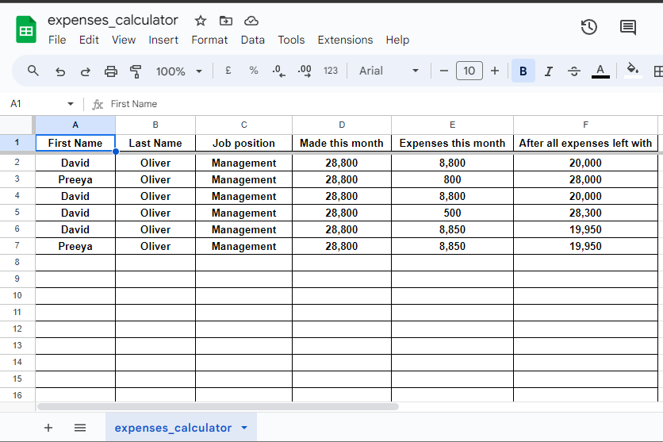

# Expenses Calculator Business Program

This is a Businesses Expenses Calculator program for all the people in contracts to use to see and calculate how much they have made this month. And it will also ask for their expenses so it can calculate after expenses for them aswell. After it has calculated after all expenses it will update the data to google sheets so they can keep track.

The live link can be found [HERE](https://expenses--calculator-4db02840ab2a.herokuapp.com/) - After clicked will open in a new window

## Contents

- [Introduction](#introduction)
- [Project](#project)
    - [User goals:](#user-goals)

- [Pre development](#pre-development)

- [Development](#development)

- [Features](#features)
    - [Name and Greet the user](#name-and-last-name-input)
    - [Job Position](#name-and-last-name-input)
    - [Expenses](#Expenses)

- [Google Sheets](#google-sheets)
    - [What information is included](#What-information-is-included)

- [Technologies Used](#technologies-used)
- [Resources](#resources)
    - [Libraries](#libraries)

- [Testing](#testing)

- [Deployment](#deployment)
    - [Heroku](#heroku)
    - [Branching the GitHub Repository using GitHub and Visual Studio Code](#branching-the-github-repository-using-github-and-visual-studio-code)

- [Credits](#credits)

---

## Introduction

This portal asks users to input their name, job position and expenses this month. Then the expenses calculater will calcutle how much the user will be left with after all expenses. Then the data will be forwarded to google sheets so the user can keep track of this month's expenses.

## Project 

The aim of this project is to:
 - Encourage users to enter the information to calculate thier expenses.
 - Provide clear, visible instructions with each visit.
 - To keep track of the users expenses via google sheets.

 

 ### User goals:

 Get clear instructions on how to use the system in front of them that they can refer to if needed.
The ability to input their details including name, job position and expenses this month. And they will be able to keep track by google sheets.

### Site owner goals

Provide a program that is easy to use and maintain.
Present a program that gives clear instructions each time a users visits.
Get access to the information inputted by google sheets.

### Pre development

I wrote out notes and created a flow chart. All I had to do then is follow my notes and code one area at a time before moving on to the next. I set up projects in GitHub to write out work that needed to be done. The aim is to provide early and continuous delivery of the project. Through out the project I did make some changes that are not in the notes.

My actual notes that created the flow chart

---

### Development

Code was written for each part of the program starting with the header and input for users to add their name. Once each section was working the development of the following section took place. Once all sections had been created testing took place which highlighted the need for additional features.

i.e. In the "input name" section the user could hit enter and a blank space would be inputted so the first and last names were made required fields. Instructions were written to ensure each user understood the importance of entering their name only. After testing with required fields, the inability to add symbols and numbers was also added.

## Features

### Name and Greet the user
This feature gives the program the information it needs to greet the user.

### Job Position

Next. The user is asked to select their job position. An error message is displayed if an invalid letter is added:

This is if the user selects and then presses n the program will loop and ask job position again. 

This is if the user select y it will then calculate how much they have made this month then ask the next question.

### Expenses

Then the user will now be ask to enter thier expenses for this month. If the user enters any alphabetical words in the input it will loop and then ask the question again.

If the user has entered the amount then they will be asked to confirm

If the user has entered the amount the presses n then the question will be asked again.

After that if the user enters the amount then presses yes all the data will be updated to google sheets

---

### Google Sheets

After the user has entered all the data and confirmed then all data will be added to google sheets for the user to keep track of thier expenses.

### What information is included

- First name
- Last name
- job position 
- expenses this month

## Technologies Used

The main technology used to create this program is Python HTML and CSS to change the outcome of the button. Google API Google Sheets.

### Resources

- Codeanywhere 
- Visual Studio Code (VSC)
- GitHub 
- Heroku
- Canva for help with images

### Libraries

- gsrpead
- dateutil

---

## Testing

The portal has been well tested and the results can be viewed [HERE - TESTING.md](TESTING.md) 

---

## Deployment

### Heroku

The Application has been deployed from GitHub to Heroku by following the steps:

1. Create or log in to your account at heroku.com
2. Create a new app, add a unique app name ( for example corri-construction-p3) and then choose your region
3. Click on create app
4. Go to "Settings"
5. Under Config Vars add the private API key information using key 'CRED' and into the value area copy the API key information added to the .json file.  Also add a key 'PORT' and value '8000'.
6. Add required buildpacks (further dependencies). For this project, set it up so Python will be on top and Node.js on bottom
7. Go to "Deploy" and select "GitHub" in "Deployment method"
8. To connect Heroku app to your Github repository code enter your repository name, click 'Search' and then 'Connect' when it shows below.
9.  Choose the branch you want to build your app from
10. If preferred, click on "Enable Automatic Deploys", which keeps the app up to date with your GitHub repository
11. Wait for the app to build. Once ready you will see the “App was successfully deployed” message and a 'View' button to take you to your deployed link.

### Branching the GitHub Repository using GitHub and Visual Studio Code
1. Open Visual Studio Code.
2. In the task bar enter >git: Clone.
3. Choose Clone from github.
4. Choose Repository name.
5. Choose a file you want to put it in.
6. Then open the project.

## Credits 

Code Institute the video that showed me how to deploy the project I had to go back and walkthrough that again so I deployed my project the correct way. - [HERE](https://www.youtube.com/watch?v=ONx3iEqAOM4)

And Google because I did my research for my date time  library.

