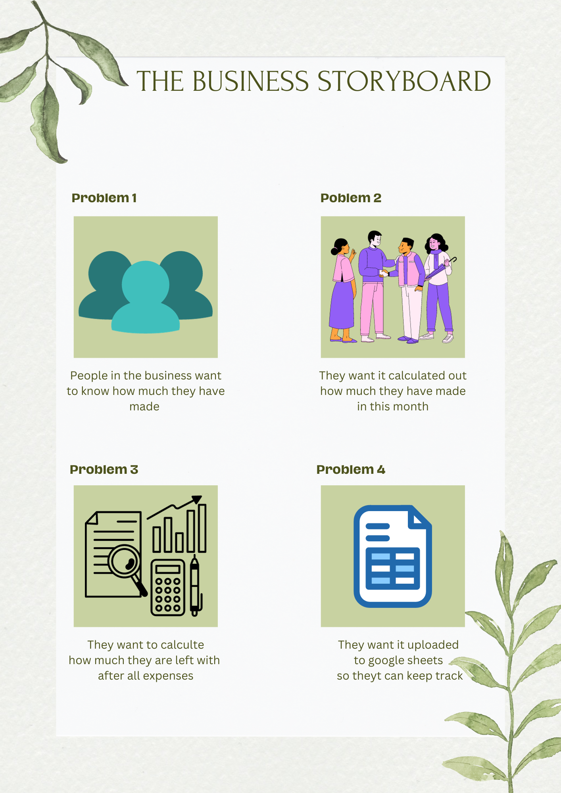

# Expenses Calculator Business Program

This is a Businesses Expenses Calculator program for all the people in contracts to use to see and calculate how much they have made this month. And it will also ask for their expenses so it can calculate after expenses for them aswell. After it has calculated after all expenses it will update the data to google sheets so they can keep track.

The live link can be found [HERE](https://expenses--calculator-4db02840ab2a.herokuapp.com/) - After clicked will open in a new window

## Contents

- [Introduction](#introduction)
- [Project](#project)
    - [User goals:](#user-goals)

- [Pre development](#pre-development)

- [Development](#development)

- [Features](#features)
    - [Name and Last name](#name-and-last-name-input)
    - [Job Position](#name-and-last-name-input)
    - [Expenses](#Expenses)
    - [Confirm information so far](#confirm-information)

- [Google Sheets](#google-sheets)
    - [Google Sheets preview](#confirm-information)
    - [What information is included](#What-information-is-included)

- [Technologies Used](#technologies-used)
- [Resources](#resources)
    - [Libraries](#libraries)

- [Testing](#testing)

- [Validation](#validation)
- [Deployment](#deployment)
    - [Heroku](#heroku)
    - [Branching the GitHub Repository using GitHub and Visual Studio Code](#branching-the-github-repository-using-github-and-visual-studio-code)

- [Credits](#credits)

---

## Introduction

This portal asks users to input their name, job position and expenses this month. Then the expenses calculater will calcutle how much the user will be left with after all expenses. Then the data will be forwarded to google sheets so the user can keep track of this month's expenses.

## Project 

The aim of this project is to:
 - Encourage users to enter the information to calculate thier expenses.
 - Provide clear, visible instructions with each visit.
 - To keep track of the users expenses via google sheets.

 

 ### User goals:

 Get clear instructions on how to use the system in front of them that they can refer to if needed.
The ability to input their details including name, job position and expenses this month. And they will be able to keep track by google sheets.

### Site owner goals

Provide a program that is easy to use and maintain.
Present a program that gives clear instructions each time a users visits.
Get access to the information inputted by google sheets.

### Pre development

I wrote out notes and created a flow chart. All I had to do then is follow my notes and code one area at a time before moving on to the next. I set up projects in GitHub to write out work that needed to be done. The aim is to provide early and continuous delivery of the project. Through out the project I did make some changes that are not in the notes.

My actual notes that created the flow chart

